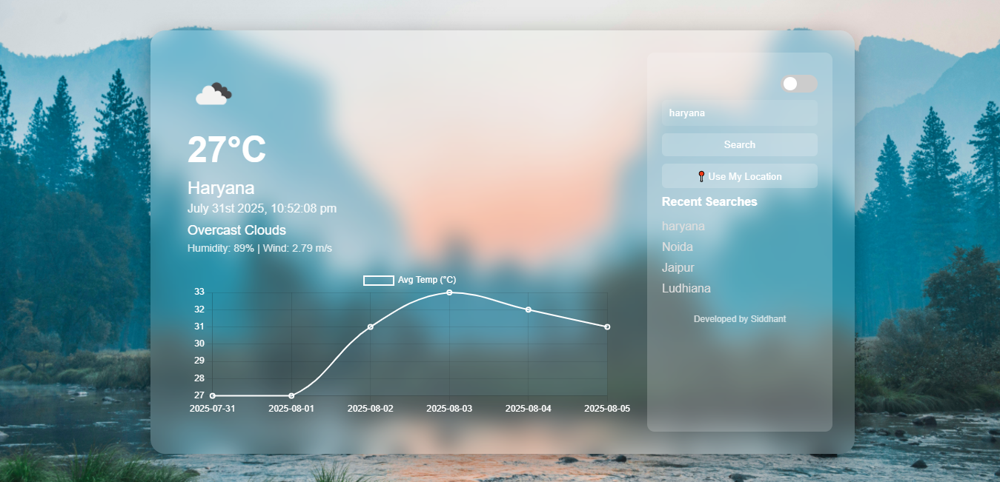

# 🌦️ DeVyneCast — Live Weather Forecast App

**🌐 Website:** [Visit Live Demo](https://devynecast.netlify.app/)

## 🌤️ Weather App Preview




## 🧭 About the App

DeVyneCast is a sleek and responsive weather forecast app that provides real-time weather updates for any city worldwide. It's designed for users who need accurate weather information on-the-go with an elegant UI.

### 🔍 Why use this app?

- ✅ Instant weather updates
- ✅ Clean and modern UI with glassmorphism
- ✅ Lightweight and responsive
- ✅ Supports multiple cities
- ✅ Built with latest frontend technologies

### 📈 Benefits & Results

- No more switching between weather sources
- Plan your day effectively with clear data
- Get real-time insights with a beautiful interface
- Save time with quick city search functionality

---

## 🚀 Features

- 🌤️ Real-time weather data from OpenWeatherMap API
- 🏙️ City-based search with autocomplete
- 🌐 Responsive layout (mobile + desktop)
- 📊 Temperature, humidity, wind speed & more
- 🎨 Glassmorphism UI design
- 🌙 Dark/Light mode 

---

## 🛠 Tech Stack

- ⚛️ React.js + Vite
- 💨 Tailwind CSS
- 🔐 .env config for secure API key management
- 🔗 OpenWeatherMap API
- 📦 Modern JavaScript (ES6+)

---

## 🧭 Future Enhancements

- 🤖 A Chat-Bot for real time suggestions
- 📱 Convert into PWA (Progressive Web App)
- 🧪 Unit tests with Vitest

---

## 📦 Installation

1. **Clone the repository**

```bash

https://github.com/siddhantshukla108/DeVyneCast.git
cd DeVyneCast

```

2. **Install dependencies**

```bash

npm install

```

3. **Start the development server**

```bash

npm run dev

```

---

## 🔑 Environment Setup

Create a file called `.env` in the root directory and add your OpenWeatherMap API key:

```env


VITE_WEATHER_API_KEY="YOUR_API_KEY"


---


## 🎥 Demo Video

▶️ [Watch the Demo](https://drive.google.com/file/d/1GsX1_hPxBhw6FiJ9HWkqFptMu4TsKG7U/view?usp=drivesdk)

---

## 📞 Contact Me

📧 **Email:** shuklasiddhant365@gmail.com  
💼 **LinkedIn:** [siddhant-shukla108](https://www.linkedin.com/in/siddhant-shukla108/) <br/>
🐦 **Twitter:** [siddhant_shuk1a](https://x.com/siddhant_shuk1a)  
🌍 **Portfolio:** [siddhantshukla-portfolio](https://siddhantshukla-portfolio.netlify.app/)

---

> ⭐ Don’t forget to star the repo if you like it!  
> 🤝 Contributions, issues, and suggestions are welcome!
